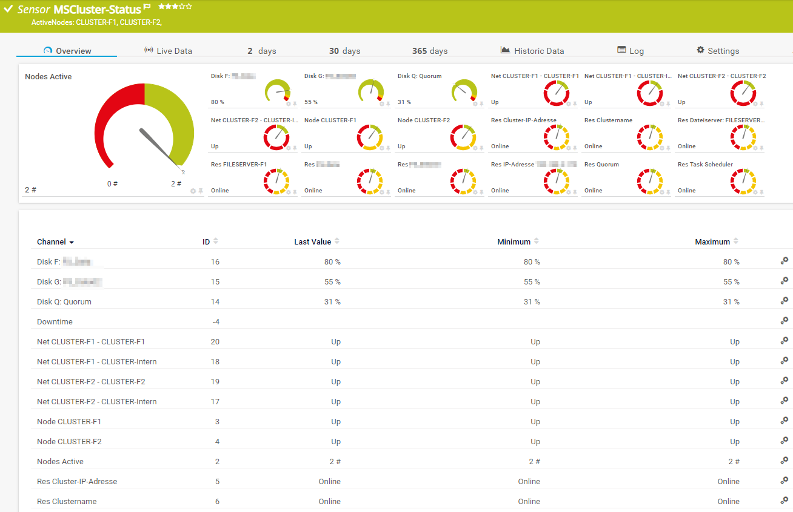

# PRTG-MSCluster-Status
# About

## Project Owner:

Jannos-443

## Project Details

Using WMI to check MS Cluster Resources, Cluster Disk space, Cluster Nodes and Cluster Interfaces

## HOW TO

1. Place "PRTG-MSCluster-Status.ps1" under "C:\Program Files (x86)\PRTG Network Monitor\Custom Sensors\EXEXML"

2. Create Sensor and set "Use Windows credentials of parent device" 

## Examples

